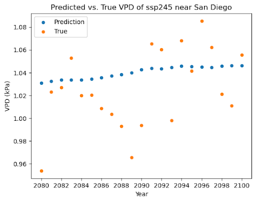
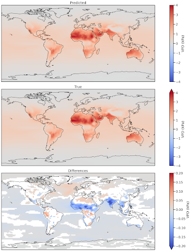

# How Global Warming Will Impact Wildfires
## Introduction

  Climate change has been shown to have a profound effect on the amount of droughts and wildfires. Specifically, climate change can lead to an increase in Vapor Pressure Deficit (VPD), which represents the difference between the level of H2O present in the atmosphere compared to how much water the atmosphere can hold. An increase in Vapor Pressure Deficit has been shown to correlate with an increase in wildfire likelihood. With more climate data being available, we are able to use deep learning models to forecast and emulate Vapor Pressure Deficit that give us a better understanding of which areas have drier vegetation, and as a result are more at risk of wildfires. With the prevalence of wildfires in various parts of the world and its relation to climate change, finding ways to efficiently model Vapor Pressure Deficit can uncover a lot about how certain climate patterns are correlated with climate change. We developed a series of climate models using Random Forests, Gaussian Process, and Convolutional Neural Networks to measure Vapor Pressure Deficit. These machine learning methods are useful because they are able to scale our climate variables for efficient training and accurately depict the time dependencies of our data.
  
  Previous work has attempted to predict wildfire likelihood by relying directly on values of temperature, precipitation, carbon emission from fire, and other wildfire related variables. Given the CMIP6 predictions for a given pathway, Gallo et al. (2023) uses the Canadian Fire Weather Index System (CFWIS), which takes in values for temperature, precipitation, relative humidity, and wind speed to make wildfire predictions, and also provides a method to evaluate these predictions based on different models. Yu et al. (2022) takes a similar approach, but instead gauges wildfires based on carbon emission from fire. In predicting fire behavior, (Rodrigeus et al. 2024) finds that Vapor Pressure Deficit (VPD) is a better predictor than several other common predictor variables when predicting fire behavior. However, current machine learning approaches which utilize VPD as a main predictor for wildfires are limited in geographical scope and not yet adapted towards climate change predictions (Buch et. al 2023).
  
  Although previous work has provided a strong framework for making wildfire predictions based on existing predictions of key variables for a certain climate pathway, our model attempts to make predictions based solely on the emissions of key climate change pollutants: CO2, SO2, CH4, and BC. Our project will be following a similar approach to our mentor's ClimateBench paper, which uses machine learning models to predict impacts of global warming (Watson-Parris et al., 2022). We will be utilizing the CESM2 dataset because it has complete data with the variables necessary to calculate Vapor Pressure Deficit, which is the driving variable for our models.

## Methods
We first compute VPD from the relative humidity and temperature obtained from the CESM2 dataset. To compute VPD, we first compute the saturation vapor pressure (SVP) from temperature in Celsius, then use the relative humidity (RH) to compute the VPD. The formulas to compute VPD are listed below:
$$SVP=0.6112\exp(\frac{17.76\times{T}}{T+243.5})$$
$$VPD=(1 - \frac{RH}{100})\times SVP$$

After we compute VPD, we create three machine learning models to test which model fits VPD the best, and create a linear model to gauge the performance of the three machine learning models. Our models use the greenhouse gas and aerosol emissions from several different climate scenarios to make predictions of global VPD up to the year 2100. To test our models, we have them predict the VPD on a scenario of moderate climate change, and compare the predictions to those made by a large-scale Earth System Model. However, our model is able to predict VPD on other climate change scenarios as well. The four models we create are listed below in more detail:
1. Linear Model: In this model, we predict VPD assuming it has a linear relationship with global mean temperature. This is our baseline model to allow us to evaluate the performance of our machine learning models.
2. Gaussian Process: We perform dimensionality reduction on the aerosol emissions data and use the first five principal components. We then fit a GP model over the emissions data using a Matern-1.5 kernel.
3. Random Forest: We use the same dimensionality reduced emissions data as the Gaussian Process to fit a random forest to predict VPD. This model is the most interpretable of the machine learning models, but can struggle with generalizing outside the training data.
4. Convolutional Neural Network: We fit a CNN-LSTM trained in 10 year time steps using 3x3 filters, and ReLU activation functions. For the LSTM layer, we also use ReLU activation and learn weights from the pooling layer using 25 memory cells. This type of model is especially suited in fitting onto our spatiotemporal emission data.

## Results

To evaluate our models, we compute the normalized root mean squared error for each of the emulator's predictions.

## Conclusion
